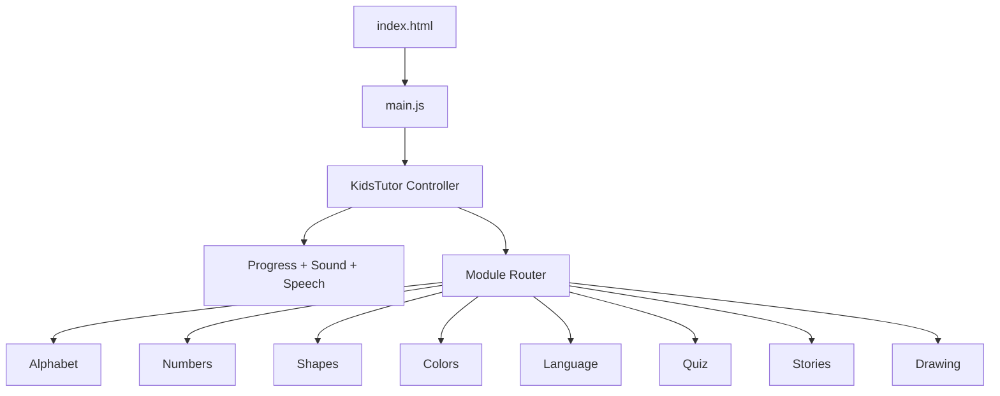

# <div align="center">AI Kids Tutor</div>

<div align="center">

### Learn. Play. Speak. Draw. Grow.

An interactive, colorful, browser-based learning playground for children built with **Vanilla JavaScript + Vite** and designed for a smooth **Vercel deployment**.

<p>
  
  
  
  
  
</p>

<p>
  
  
  
  
  
</p>

</div>

---

<div align="center">

## A Bright Little World of Learning

</div>

**AI Kids Tutor** is a kid-friendly educational web app that turns foundational learning into an engaging digital playground.  
Instead of presenting lessons as static content, it wraps learning inside movement, color, speech, rewards, mini-games, and creative interaction.

Children can:

- explore the **alphabet**
- practice **numbers and counting**
- learn **shapes and colors**
- discover words in **multiple languages**
- answer **quizzes**
- build tiny **stories**
- paint and draw on interactive **canvases**

Everything runs entirely in the browser, making the project lightweight, portable, and ideal for **student demos, prototypes, coursework, and static hosting on Vercel**.

---

## Table of Contents

- [Why It Stands Out](#why-it-stands-out)
- [Experience Snapshot](#experience-snapshot)
- [Feature Universe](#feature-universe)
- [Module Showcase](#module-showcase)
- [Tech Stack](#tech-stack)
- [Architecture](#architecture)
- [Project Structure](#project-structure)
- [How the App Works](#how-the-app-works)
- [Local Development](#local-development)
- [Production Build](#production-build)
- [Vercel Deployment](#vercel-deployment)
- [Browser APIs Used](#browser-apis-used)
- [Limitations](#limitations)
- [Future Upgrades](#future-upgrades)
- [Quick Start](#quick-start)

---

## Why It Stands Out

<table>
  <tr>
    <td width="33%" valign="top">
      <h3>Playful by Design</h3>
      <p>Bright gradients, large cards, emoji-rich lessons, and cheerful feedback make the interface feel welcoming for children.</p>
    </td>
    <td width="33%" valign="top">
      <h3>Interactive Learning</h3>
      <p>The app does not stop at display. It speaks, reacts, rewards, checks answers, and encourages repeated exploration.</p>
    </td>
    <td width="33%" valign="top">
      <h3>Easy to Deploy</h3>
      <p>No backend, no database, no authentication setup, no environment secrets. It is a static app built for simple hosting.</p>
    </td>
  </tr>
</table>

---

## Experience Snapshot

<div align="center">

```text
 Alphabet   Numbers   Shapes   Colors
 Language   Quiz      Stories  Drawing

 + Voice feedback
 + Star rewards
 + Progress tracking
 + Confetti celebrations
 + Creative exploration
```

</div>

### Core Experience Pillars

- **Learn visually** through cards, symbols, and real-world object examples
- **Hear concepts aloud** with browser speech synthesis
- **Get rewarded** through star collection and celebration effects
- **Create freely** using drawing and coloring tools
- **Stay lightweight** with a pure frontend architecture

---

## Feature Universe

<details open>
<summary><strong>Interactive learning systems included</strong></summary>

- 8 educational modules in one app
- Global progress system with star accumulation
- Sound effects via Web Audio API
- Pronunciation and read-aloud support via Speech Synthesis
- Canvas-based drawing and coloring
- Quiz and game-based reinforcement
- Local session persistence with `localStorage`
- Responsive single-page style interaction flow

</details>

<details>
<summary><strong>Why the app is deployment-friendly</strong></summary>

- No server runtime
- No API routes
- No database connection
- No auth provider setup
- No environment variables required for basic use
- Vite-based build process
- Static hosting compatible

</details>

---

## Module Showcase

### Alphabet

> Flashcards + pronunciation + matching game  
Children move from letter recognition to word association in a visual, tap-friendly flow.

### Numbers

> Counting + object interaction + quantity game  
Numbers are introduced through visuals and reinforced with simple counting mechanics.

### Shapes

> Learn + trace + hunt  
The shapes module combines explanation, tracing, and recognition tasks to help children connect shapes to everyday life.

### Colors

> Learn + paint + quiz  
Color learning transitions naturally into painting and then into recognition checks.

### Language

> Flashcards + matching + listening  
Introduces multilingual vocabulary using voice-supported, visual word associations.

Supported right now:

- Spanish
- French
- German
- Italian

### Quiz

> Category-based challenge mode  
Lets children test understanding through multiple-choice questions and simple score feedback.

### Stories

> Theme selection + character selection + generated story  
Encourages imagination while still feeling structured and child-safe through template-based story creation.

### Drawing

> Free creativity zone  
Offers drawing, brush tools, erasing, shapes, challenges, saving, and sharing.

---

## Tech Stack

<table>
  <tr>
    <td><strong>Language</strong></td>
    <td>JavaScript (ES Modules)</td>
  </tr>
  <tr>
    <td><strong>Bundler</strong></td>
    <td>Vite</td>
  </tr>
  <tr>
    <td><strong>Markup</strong></td>
    <td>HTML5</td>
  </tr>
  <tr>
    <td><strong>Styling</strong></td>
    <td>Tailwind via CDN + inline CSS</td>
  </tr>
  <tr>
    <td><strong>Persistence</strong></td>
    <td>localStorage</td>
  </tr>
  <tr>
    <td><strong>Audio / Voice</strong></td>
    <td>Web Audio API + Speech Synthesis</td>
  </tr>
  <tr>
    <td><strong>Deployment</strong></td>
    <td>Vercel</td>
  </tr>
</table>

---

## Architecture

### App Model

This project is a **fully client-side static application**.

That means:

- no backend server
- no API dependency for the main learning flow
- no database
- no session management
- no user login system

### Runtime Flow



### Design Principle

The architecture favors:

- simplicity
- readability
- direct DOM control
- fast iteration
- easy hosting

---

## Project Structure

```text
AI_KIDS_TUTOR/
|-- index.html
|-- main.js
|-- package.json
|-- package-lock.json
|-- vercel.json
|-- .vercelignore
|-- README.md
|-- modules/
|   |-- alphabet.js
|   |-- numbers.js
|   |-- shapes.js
|   |-- colors.js
|   |-- language.js
|   |-- quiz.js
|   |-- stories.js
|   |-- drawing.js
|-- public/
|   |-- vite.svg
|-- counter.js
|-- style.css
|-- javascript.svg
|-- ai-tutor.zip
```

### Important Files

- [`index.html`](D:/HARDIK/SEM%207/CAPSTONE/AI_KIDS_TUTOR/AI_KIDS_TUTOR/index.html)  
  Main visual shell and app container.

- [`main.js`](D:/HARDIK/SEM%207/CAPSTONE/AI_KIDS_TUTOR/AI_KIDS_TUTOR/main.js)  
  Core controller for progress, sound, speech, module loading, and shared utilities.

- [`modules/alphabet.js`](D:/HARDIK/SEM%207/CAPSTONE/AI_KIDS_TUTOR/AI_KIDS_TUTOR/modules/alphabet.js)  
  Alphabet lesson and matching game.

- [`modules/numbers.js`](D:/HARDIK/SEM%207/CAPSTONE/AI_KIDS_TUTOR/AI_KIDS_TUTOR/modules/numbers.js)  
  Counting content and number game.

- [`modules/shapes.js`](D:/HARDIK/SEM%207/CAPSTONE/AI_KIDS_TUTOR/AI_KIDS_TUTOR/modules/shapes.js)  
  Shape learning, tracing, and hunt mode.

- [`modules/colors.js`](D:/HARDIK/SEM%207/CAPSTONE/AI_KIDS_TUTOR/AI_KIDS_TUTOR/modules/colors.js)  
  Color lessons, paint mode, and quiz mode.

- [`modules/language.js`](D:/HARDIK/SEM%207/CAPSTONE/AI_KIDS_TUTOR/AI_KIDS_TUTOR/modules/language.js)  
  Multilingual word learning.

- [`modules/quiz.js`](D:/HARDIK/SEM%207/CAPSTONE/AI_KIDS_TUTOR/AI_KIDS_TUTOR/modules/quiz.js)  
  General quiz engine and category flow.

- [`modules/stories.js`](D:/HARDIK/SEM%207/CAPSTONE/AI_KIDS_TUTOR/AI_KIDS_TUTOR/modules/stories.js)  
  Theme-driven story creation.

- [`modules/drawing.js`](D:/HARDIK/SEM%207/CAPSTONE/AI_KIDS_TUTOR/AI_KIDS_TUTOR/modules/drawing.js)  
  Drawing canvas, tools, and challenges.

---

## How the App Works

### Initialization Sequence

1. `index.html` loads the page shell and app layout.
2. `main.js` imports all learning modules.
3. A `KidsTutor` controller instance initializes the experience.
4. Stored progress and sound settings are loaded from `localStorage`.
5. Clicking a module card calls the relevant module loader.
6. Interactions award stars, play feedback sounds, and can trigger speech output.

### Shared Systems

- **Progress system**  
  Tracks stars earned across modules.

- **Audio system**  
  Generates simple sound effects using oscillator nodes.

- **Speech system**  
  Speaks letters, words, prompts, and stories.

- **Reward system**  
  Uses stars and confetti to reinforce interaction.

---

## Local Development

### Requirements

- Node.js `18+`
- npm

### Install Dependencies

```bash
npm install
```

### Start Development Server

```bash
npm run dev
```

Vite will provide a local URL such as:

```text
http://localhost:5173
```

### Very Important

Do **not** run the app by double-clicking `index.html` and opening it through `file://`.

That can cause:

- module loading errors
- CORS-related browser restrictions
- broken script resolution
- missing global functions

Use a local HTTP server instead, preferably Vite.

---

## Production Build

### Build

```bash
npm run build
```

### Preview the Production Output

```bash
npm run preview
```

The built static files are generated in:

```text
dist/
```

---

## Vercel Deployment

<div align="center">

### Smooth Static Deployment Path

</div>

This project is suitable for **Vercel** because it is a **frontend-only static app**.

### Deploy with Git Integration

1. Push the project to GitHub, GitLab, or Bitbucket.
2. Open Vercel.
3. Click **Add New Project**.
4. Import the repository.
5. Let Vercel detect the framework.
6. Deploy.

### Expected Build Settings

```text
Framework Preset: Vite
Build Command:    npm run build
Output Directory: dist
```

### Deploy with CLI

```bash
vercel
```

For production:

```bash
vercel --prod
```

### Included Deployment Files

- [`vercel.json`](D:/HARDIK/SEM%207/CAPSTONE/AI_KIDS_TUTOR/AI_KIDS_TUTOR/vercel.json)
- [`.vercelignore`](D:/HARDIK/SEM%207/CAPSTONE/AI_KIDS_TUTOR/AI_KIDS_TUTOR/.vercelignore)

---

## Browser APIs Used

<details open>
<summary><strong>SpeechSynthesis</strong></summary>

Used for:

- pronunciation support
- multilingual word playback
- story read-aloud experiences

</details>

<details open>
<summary><strong>Web Audio API</strong></summary>

Used for:

- click sounds
- success sounds
- reward sounds
- error feedback

</details>

<details open>
<summary><strong>localStorage</strong></summary>

Used for:

- saving stars
- storing progress
- remembering sound preference

</details>

<details open>
<summary><strong>Canvas API</strong></summary>

Used for:

- drawing interactions
- coloring mode
- saving artwork

</details>

<details open>
<summary><strong>navigator.share / navigator.clipboard</strong></summary>

Used in the drawing module for share interactions and fallback copy behavior.

</details>

---

## Limitations

This project is functional and deployable, but a few things are still prototype-oriented:

- Tailwind is currently loaded from the CDN instead of a local build pipeline
- data is hardcoded in the frontend
- there are no automated tests yet
- progress only exists in the local browser
- no multi-user support exists
- no teacher, admin, or analytics dashboard exists

---

## Future Upgrades

### High-Impact Improvements

- convert Tailwind CDN usage into a proper Vite/PostCSS setup
- add automated tests
- improve accessibility and keyboard navigation
- add more learning modules and quizzes
- introduce backend persistence for shared progress
- add dashboards for parents or teachers
- support richer content authoring
- improve mobile polish for smaller screens

### Dream Version

- AI-assisted story generation
- personalized learning paths
- spoken answer recognition
- achievement system
- printable worksheets
- teacher classroom mode

---

## Unused or Legacy Files

These appear to be starter leftovers or packaging artifacts and are not central to the main runtime:

- `counter.js`
- `style.css`
- `javascript.svg`
- `public/vite.svg`
- `ai-tutor.zip`

---

## Quick Start

```bash
npm install
npm run dev
```

Then open:

```text
http://localhost:5173
```

---

## Project Personality

This app aims to feel:

- joyful
- visual
- lightweight
- encouraging
- beginner-friendly

It is ideal for:

- academic capstone showcases
- frontend demos
- learning product prototypes
- kid-focused educational experiments
- simple public deployment on Vercel

---

## Final Note

<div align="center">

### Built to make learning feel like play.

If you want, this README can be taken even further with:

`preview screenshots` • `custom banners` • `GIF demos` • `project logo` • `live demo section`

</div>
